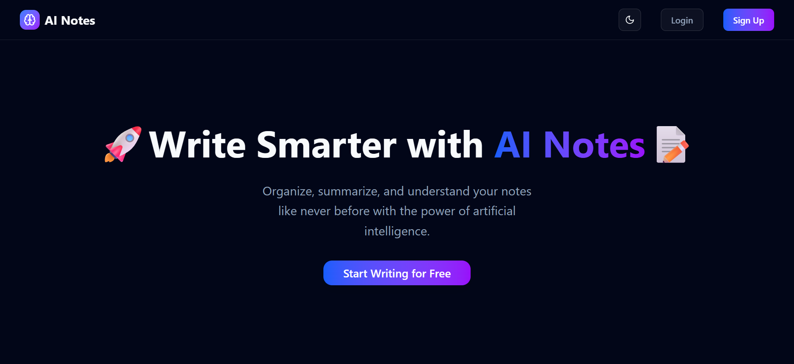
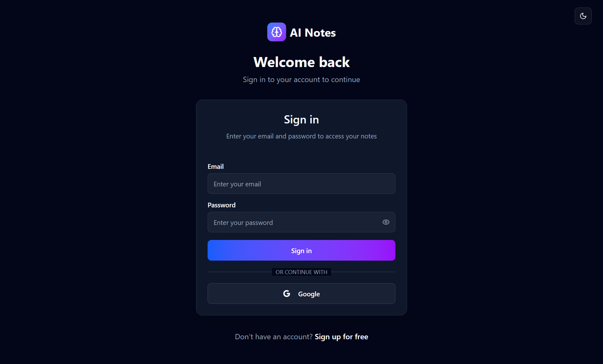
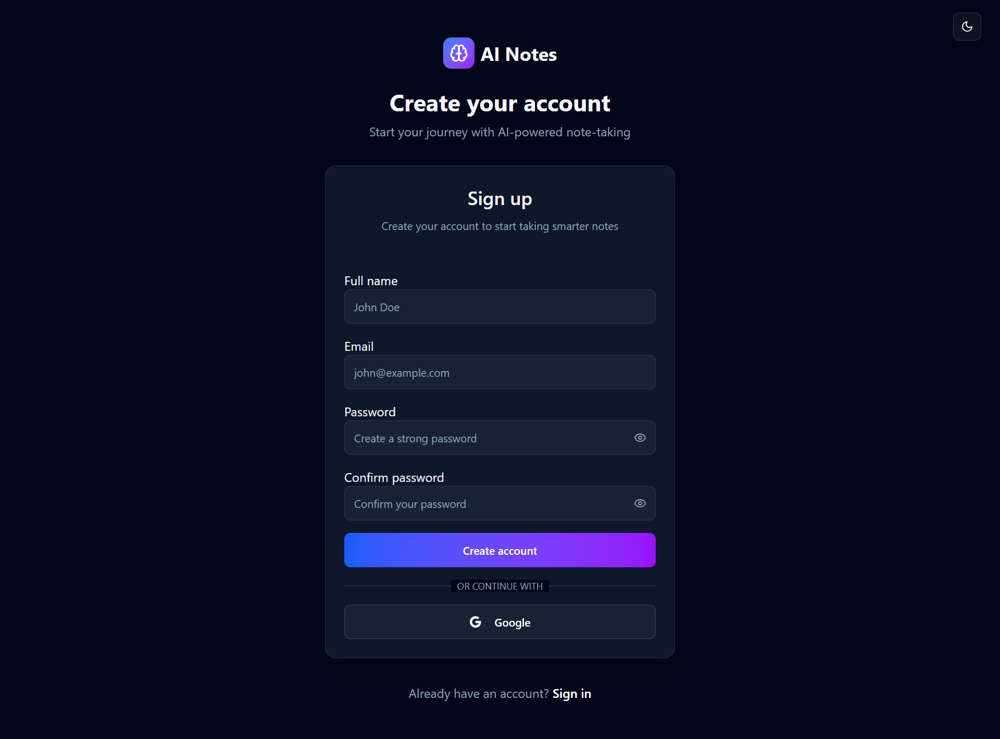
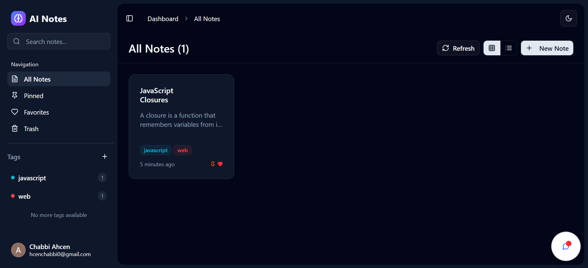

# 🧠 AI Notes – Smart Note Search Assistant

> TL;DR: AI-powered note-taking app with Google login, smart search, and rich-text editing.

**AI Notes** is a full-stack web app that lets users **store**, **organize**, and **search** their notes using **AI-powered search** and a modern chat interface. With support for **Google OAuth**, secure credentials, and a polished UI, it acts as your ultimate digital memory.

## 🌐 Live Demo

🔗 [https://ai-notes-zeta.vercel.app](https://ai-notes-zeta.vercel.app)

## ✨ Features

- 📄 Create, update, delete, and filter rich-text notes (Notion-style)
- 🔐 Authentication with **Google OAuth** and **Email/Password**
- 🧠 AI-powered chatbot: ask anything about your notes
- 🎨 Modern UI with **Tailwind CSS** and **shadcn/ui**
- 🚀 And much more... explore the app to discover hidden gems!

## 🧪 Tech Stack

| Tech                      | Purpose                               |
| ------------------------- | ------------------------------------- |
| **Next.js 15**            | App framework (App Router)            |
| **Tailwind CSS**          | Utility-first styling                 |
| **shadcn/ui**             | Prebuilt accessible components        |
| **Prisma + PostgreSQL**   | ORM and relational database           |
| **Auth.js**               | Authentication (Google + credentials) |
| **Vercel AI SDK**         | Chatbot & AI integration              |
| **Zustand**               | State management                      |
| **Novel**                 | Notion-style WYSIWYG editor           |
| **React Hook Form + Zod** | Forms & schema validation             |
| **React Query + Axios**   | Data fetching & caching               |
| **Resend**                | Email notifications                   |
| **Nuqs**                  | Type-safe search params state         |
| **Lucide React**          | Icon library                          |
| **Vercel Blob**           | File uploads                          |
| **Arcjet**                | App-level protection & rate limiting  |
| **Vercel**                | Hosting & deployment                  |

## 📸 Screenshots

- 🏠 Landing Page  
  

- 🔐 Login Page  
  

- 📝 Signup Page  
  

- 📋 Dashboard  
  

## 📄 License

This project is licensed under the [MIT License](./LICENSE).
